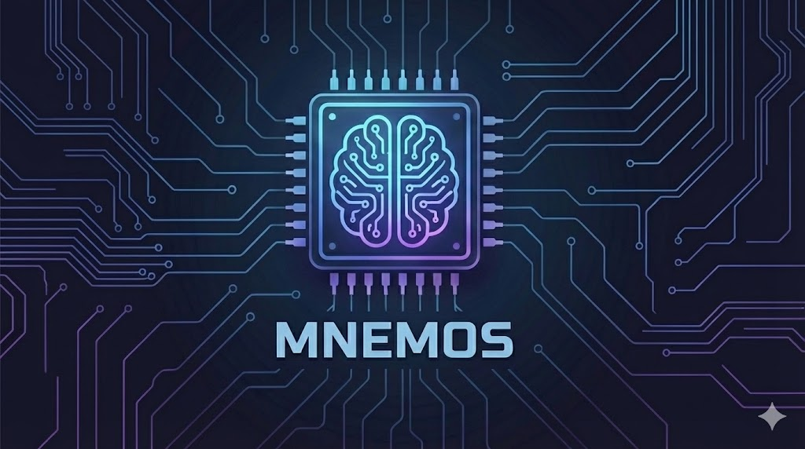

# Mnemos: A Second Brain for Your Code

**Multi-editor support** | **Markdown storage** | **AI-assisted understanding**

Mnemos attaches persistent notes to specific code locations. Notes live **outside your codebase** in `.mnemos/notes/` as plain markdown files—version-controlled separately, never cluttering your source.

Ask AI to explain any code region—summaries or detailed explanations are saved as notes for future reference.

Unlike line-based comments, notes are anchored to **AST nodes** (functions, classes, variables) using Tree-sitter parsing. When you refactor code, notes stay attached to their target even if line numbers change.

## How It Works

1. **Add a note** - Position cursor on a function/class/variable, press the keybinding
2. **Note anchors to AST node** - Mnemos uses Tree-sitter to identify the code element and stores a hash of its content
3. **Code changes** - When the code is modified, Mnemos detects the hash mismatch and marks the note as "stale"
4. **Reattach** - Search nearby lines for similar code, or manually reattach to a new location

## Features

- **AST-anchored notes** - Notes attach to functions, classes, variables (not line numbers)
- **Staleness detection** - Knows when anchored code has changed
- **Reattachment** - Find and reattach stale notes after refactoring
- **Full-text search** - Search across all notes and source code via ripgrep
- **Note linking** - Link notes together with `[[description][id]]` syntax
- **Backlinks** - See which notes reference the current note
- **AI explanations** - Generate code explanations with Claude/Codex (optional)

## Demo

When code changes, notes may become stale. Mnemos detects this and lets you reattach them:

[](assets/demo-reattach.mp4)

## Why Markdown Storage?

Mnemos stores your notes as plain markdown files in `.mnemos/notes/`. This design choice provides significant benefits:

- **Human-readable** - Notes stored as plain markdown files you can read and edit anywhere
- **Git-friendly** - Track note history, diff changes, and collaborate with your team
- **No lock-in** - Your notes are just files you own, not trapped in a database
- **Portable** - Share the `.mnemos/` folder with your team via git or any file sync
- **Editor-agnostic** - Edit notes directly in any text editor, IDE, or even GitHub

## Architecture

```
┌─────────────┐                        ┌─────────────────────────────┐
│   Emacs     │     Unix Socket        │                             │
│   mnemos.el │◄──────────────────────►│                             │
└─────────────┘                        │                             │
               ~/.mnemos/mnemos.sock   │   Backend Server            │
┌─────────────┐     Unix Socket        │   (Single Process)          │
│   Neovim    │◄──────────────────────►│                             │
│   mnemos.lua│                        │   - Reference counting      │
└─────────────┘                        │   - Grace period shutdown   │
                                       │   - Version checking        │
┌─────────────┐     Unix Socket        │                             │
│   VS Code   │◄──────────────────────►│                             │
│   extension │                        └──────────────┬──────────────┘
└─────────────┘                                       │
                                                      ▼
                                           ┌───────────────────┐
                                           │  .mnemos/notes/   │
                                           │    *.md files     │
                                           │  (plain markdown) │
                                           └───────────────────┘
```

All editors connect to a single backend process via Unix domain socket. The first editor to need the backend starts it; subsequent editors connect. Backend shuts down after 30s with no connections.

## Notes Storage Location

Mnemos stores notes as markdown files in `.mnemos/notes/` within your project directory. Each note is a standalone `.md` file with YAML frontmatter containing metadata (anchor information, timestamps, links).

```
your-project/
  .mnemos/
    notes/
      abc123.md    # Individual note files
      def456.md    # Named by unique ID
      ...
```

This enables:
- **Version control**: Commit `.mnemos/` alongside your code
- **Team collaboration**: Share notes via git push/pull
- **Backup**: Notes are backed up with your normal file backups
- **Direct editing**: Open any `.md` file in your favorite editor

To use a different location:

```bash
export MNEMOS_NOTES_PATH=/path/to/custom/notes/
```

## Quick Start

### Build the Backend

```bash
git clone https://github.com/joelreymont/mnemos
cd mnemos
zig build -Doptimize=ReleaseFast
```

The binary is at `zig-out/bin/mnemos`. Requires system libraries (tree-sitter, libgit2).

### Installation

See the setup guide for your editor:

- **Doom Emacs**: [docs/DOOM-EMACS.md](docs/DOOM-EMACS.md)
- **Neovim (LazyVim)**: [docs/NEOVIM.md](docs/NEOVIM.md)
- **VS Code**: [ui/vscode/README.md](ui/vscode/README.md)
- **Vanilla Emacs**: [ui/emacs/README.md](ui/emacs/README.md)

## Key Bindings

All editors use a consistent `<prefix> m` pattern:

| Action | Emacs | Neovim | Description |
|--------|-------|--------|-------------|
| Add note | `C-c m a` | `<leader>ma` | Add note at cursor |
| Add note (multiline) | - | `<leader>mA` | Add multiline note |
| Select note | `C-c m s` | `<leader>ms` | Select note at cursor |
| List notes | `C-c m l` | `<leader>ml` | List notes in file |
| Refresh | `C-c m r` | `<leader>mr` | Refresh note display |
| Edit note | `C-c m e` | `<leader>me` | Edit selected note |
| Edit note (buffer) | `C-c m E` | `<leader>mE` | Edit in full buffer |
| Delete note | `C-c m d` | `<leader>md` | Delete selected note |
| Reattach note | `C-c m R` | `<leader>mR` | Reattach stale note |
| Search file | - | `<leader>mf` | Search notes in file |
| Search project | `C-c m f` | `<leader>mF` | Search project |
| Index file | - | `<leader>mP` | Legacy: no indexing required |
| Index project | `C-c m p` | `<leader>mp` | Legacy: no indexing required |
| Insert link | `C-c m k` | `<leader>mk` | Insert note link |
| Show backlinks | `C-c m b` | `<leader>mb` | Show notes linking here |
| Explain region | `C-c m x` | `<leader>mx` | Explain code (visual) |
| Explain (detailed) | `C-c m X` | `<leader>mX` | Detailed AI explanation |
| Status | `C-c m S` | `<leader>mt` | Show backend status |
| Help | `C-c m ?` | `<leader>m?` | Show keybindings |

## AI Features

Mnemos can use AI to explain any code region. Select code visually and press `<leader>mx` for a summary or `<leader>mX` for a detailed explanation. The AI response is automatically saved as a note attached to that code location.

Set the provider:

```bash
export MNEMOS_AI_PROVIDER=claude  # or codex, none
```

## Testing

```bash
# Backend
zig build test

# Neovim (requires plenary.nvim)
cd ui/neovim && nvim --headless -u tests/minimal_init.lua \
  -c "PlenaryBustedDirectory tests/ {minimal_init = 'tests/minimal_init.lua'}"

# Emacs
emacs -Q --batch -L ui/emacs -l mnemos.el \
  -L ui/emacs/tests -l mnemos-test.el -f ert-run-tests-batch-and-exit
```

## Protocol

The backend speaks JSON-RPC 2.0 over Unix domain socket (`~/.mnemos/mnemos.sock`). See [docs/PROTOCOL.md](docs/PROTOCOL.md) for the full API.

## License

MIT
